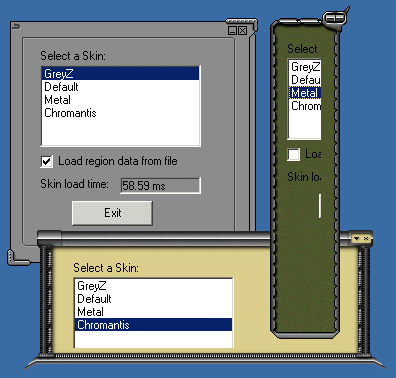



## Dynamic Resizable Skins Demo v1\.2

### Description

An update to my demo - how to combine transparency AND resizability. Check it out. Skin loading is now 50% faster thanks to using a cache file for storing region (transparency) data.

For a complete app that's based on this code, go to: http://kewlpad.deviantart.net Home of kewlpAd - The skinnable notepad.
 
### More Info
 

             |
---                |---
**Submitted On**   |2001-06-08 13:12:36
**By**             |[Elad Rosenheim](https://github.com/Planet-Source-Code/PSCIndex/blob/master/ByAuthor/elad-rosenheim.md)
**Level**          |Intermediate
**User Rating**    |5.0 (30 globes from 6 users)
**Compatibility**  |VB 6\.0
**Category**       |[Custom Controls/ Forms/  Menus](https://github.com/Planet-Source-Code/PSCIndex/blob/master/ByCategory/custom-controls-forms-menus__1-4.md)
**World**          |[Visual Basic](https://github.com/Planet-Source-Code/PSCIndex/blob/master/ByWorld/visual-basic.md)
**Archive File**   |[Dynamic Re20794682001\.zip](https://github.com/Planet-Source-Code/elad-rosenheim-dynamic-resizable-skins-demo-v1-2__1-23881/archive/master.zip)

